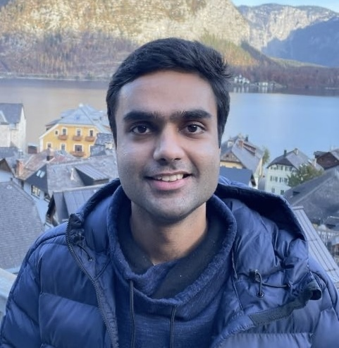

  

  <h1>Mehul Sethi</h1>

  <strong>Software Engineer</strong> | Full Stack Development | Cloud & DevOps

  📍 Munich, Germany | 💼 AutoScout24 | 🚀 7+ Years Experience

---

## About Me

I'm a passionate Software Engineer with 8+ years of experience building scalable, robust applications across the full technology stack. Currently working at **AutoScout24** in Munich, Germany, I specialize in backend services, modern frontend experiences, and cloud infrastructure with a strong focus on DevOps practices.

## Technical Expertise

### Backend Development
Building robust server-side applications, RESTful APIs, microservices architecture, and database design.

### Frontend Development
Creating responsive, user-centric web applications with modern frameworks and best practices.

### Cloud & DevOps
Designing and implementing cloud infrastructure, CI/CD pipelines, containerization, and automated deployment strategies.

## Resume

View my complete professional background and experience:

**[Download Resume (PDF)](./Mehul_CV.pdf)**

## Connect With Me

---

### Technologies & Tools

**Languages:** Python, JavaScript, TypeScript, Java, Go
**Frontend:** React, Vue.js, Angular, HTML5, CSS3
**Backend:** Node.js, Express, Django, Spring Boot
**Cloud:** AWS, Azure, Google Cloud Platform
**DevOps:** Docker, Kubernetes, Jenkins, GitHub Actions, Terraform
**Databases:** PostgreSQL, MongoDB, Redis, MySQL

---

*This repository serves as my professional portfolio and GitHub Pages site.*
